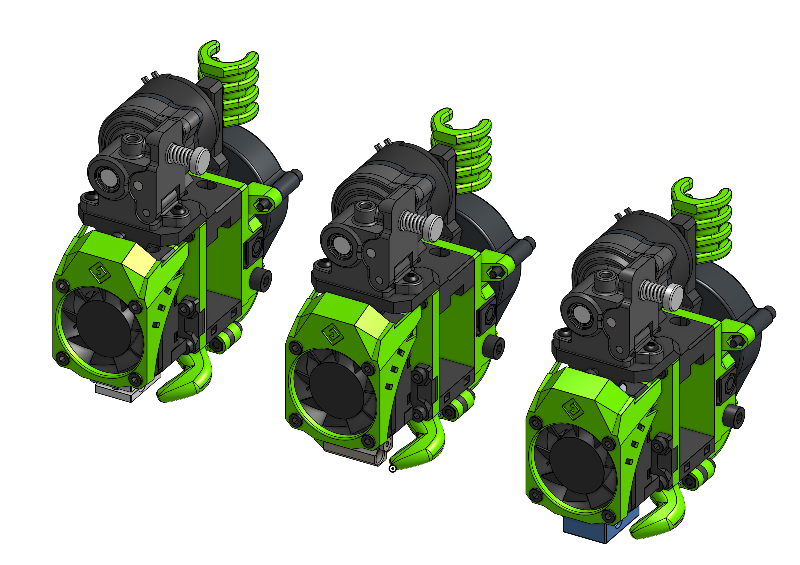

---
badges:
    - Official
---
# Orbiter

EVA 2 now supports [The Orbiter](https://www.thingiverse.com/thing:4223085) created by Robert Lorincz. Orbiter 1.5 was released during the development of this EVA module so for now 1.5 is not supported but when it comes to the older, supported version we have both the default and the CR-10 mounting options.

### Links

{{ eva_download_button("orbiter") }}

{{ eva_link("orbiter") }}

{{ onshape_link("orbiter") }}

### BOM

=== "E3D V6"

{{ bom("drives/orbiter/bom/BOM_[Assembly]_V6.csv", 4) }}

=== "Mosquito"

{{ bom("drives/orbiter/bom/BOM_[Assembly]_mosquito.csv", 4) }}

=== "Dragon"

{{ bom("drives/orbiter/bom/BOM_[Assembly]_dragon.csv", 4) }}
